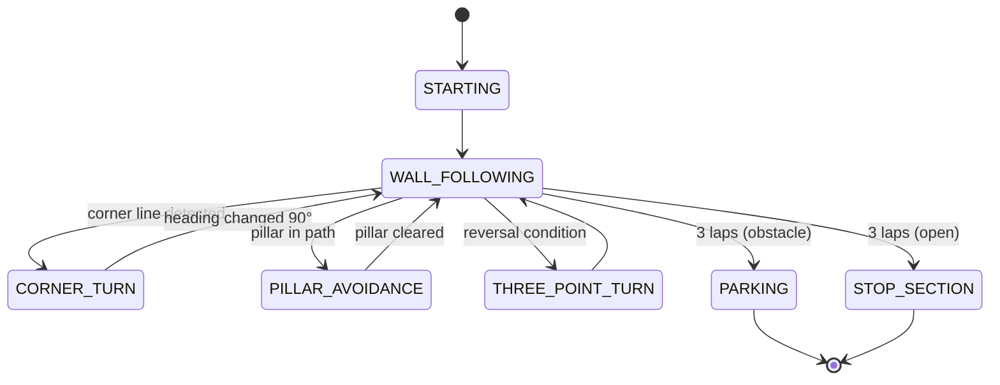

# Artemis — WRO 2026 Future Engineers

**Team Artemis · UGhana Robotics · University of Ghana**

Artemis is an autonomous self-driving vehicle built for the [WRO Future Engineers](https://wro-association.org/) 2026 season. Our core engineering idea is **one brain, two bodies**: the control logic is developed and validated in a purpose-built 2D simulator, then the *same code* drives the physical robot through a thin hardware-abstraction layer. Every algorithm on the vehicle was tuned against hundreds of simulated runs before it ever touched the mat.

## Contents

- [Repository structure](#repository-structure)
- [The challenge](#the-challenge)
- [The vehicle](#the-vehicle)
- [1. Mobility and mechanical design](#1-mobility-and-mechanical-design)
- [2. Power and sensor architecture](#2-power-and-sensor-architecture)
- [3. Software architecture](#3-software-architecture)
- [4. Engineering decisions and lessons](#4-engineering-decisions-and-lessons)
- [5. Reproducing the robot](#5-reproducing-the-robot)
- [Testing workflow](#testing-workflow)
- [Status](#status)

## Repository structure

```
artemis/
├── src/
│   ├── core/                    # Shared control brain — runs in BOTH sim and robot
│   ├── sim/
│   │   ├── open-challenge-sim/  # 2D simulator, viewer, and test suites
│   │   └── obstacle-challenge-sim/
│   └── robot/                   # Raspberry Pi runtime: drivers, HAL, entry points
│       ├── drivers/             # motor, servo, ToF, IMU, color, camera
│       ├── bench/               # per-device bring-up & diagnostic scripts
│       └── web/                 # teleop + telemetry dashboard (systemd service)
├── docs/                        # Engineering docs: control architecture, IMU study, track layouts
├── schemes/                     # Wiring diagram (PNG/SVG) + docs/schematics/ PDF
├── models/                      # CAD: cad-source/ (STEP), print/ (STL), v1/ (retired design)
├── v-photos/                    # Vehicle photos (6 views)
├── t-photos/                    # Team photos
└── video/                       # Run videos + YouTube link (video.md)
```

## The challenge

A vehicle must complete **three autonomous laps** on a track whose geometry is randomized every round: the **Open Challenge** varies the track width between 600 and 1000 mm, and the **Obstacle Challenge** adds red/green traffic pillars (red → pass on the right, green → pass on the left), a possible mid-run direction reversal, and finishes with **parallel parking** into a slot only 1.5× the vehicle length. Official rules: [WRO Future Engineers 2026](https://wro-association.org/competition/2026-season/).

## The vehicle

Six views of the vehicle are in [`v-photos/`](v-photos). Key figures:

| Property | Value |
|---|---|
| Footprint | 140 mm × 88 mm (rules allow 300 × 200) |
| Wheelbase | 76 mm |
| Weight | ≈ 219 g |
| Drive | Single 12 V N20-class gearmotor, rear differential |
| Steering | Ackermann geometry, SG90 servo, ±35° measured throw |
| Wheels | LEGO 55981C05, ⌀30.4 mm |
| Top speed | ≈ 216 mm/s (136 rpm at the wheel × 95.5 mm circumference) |
| Compute | Raspberry Pi 3B+ |

We deliberately built **small and slow-ish**: at cruise (80% throttle, ≈173 mm/s) a 3-lap run takes ≈2:24 against the 3:00 limit. The compact footprint buys margin everywhere else — wider effective corridors on the 600 mm narrow track, easier pillar avoidance, and a parking slot that is comfortably 1.5× our length.

## 1. Mobility and mechanical design

- **Ackermann steering.** The front wheels are steered through an Ackermann linkage so the inner wheel turns tighter than the outer one, minimizing scrub in the 90° corners. The linkage is driven directly by the servo horn; we measured the real assembled throw at ±35° and use that as the software steering limit ([`src/core/config.py`](src/core/config.py)).
- **Single-motor rear drive with differential**, as required by the rules. Torque/speed trade-off: with ⌀30.4 mm wheels and the N20 gearmotor, top speed is ≈216 mm/s — slow enough that we never needed encoder-based speed control for lap timing, fast enough for a ~2:24 three-lap run.
- **Two chassis generations.** Our first fully 3D-printed design ([`models/v1/`](models/v1), documented in [`models/README.md`](models/README.md)) packed everything into a 140 mm shell for protection — and taught us a hard lesson: it was so cramped that every wiring fault meant a full teardown. During electrical bring-up (see §4) that cost us days. The current design ([`models/cad-source/`](models/cad-source) STEP sources, [`models/print/`](models/print) print-ready STLs) is a **tub + lid** with a slip-fit joint: the lid lifts off tool-free, exposing the entire loom and every board for probing, and ventilation cut-outs keep the Pi cool.

## 2. Power and sensor architecture

Wiring diagram: [`schemes/circuit_image.png`](schemes/circuit_image.png) (editable SVG alongside; full schematic PDF in [`docs/schematics/`](docs/schematics)).

**Power.** A 12 V rechargeable pack feeds the drive motor directly through the H-bridge; an XL4015 buck converter steps down to 5 V for the Pi, servo, and sensors, isolating logic from motor sag.

**Sensors and why we chose them:**

| Sensor | Role | Placement rationale |
|---|---|---|
| 4× VL53L1X ToF | Wall ranging (front/left/right/rear) | Long-distance mode (≤3.6 m) covers the full 1000 mm track width with margin; left/right pair gives centring error, front detects the corner wall, rear disambiguates the start section |
| LSM6DSOX IMU | Heading (gyro-hold mode) | Bench-measured ≈0.07°/min raw drift (study: [`docs/imu-accuracy.md`](docs/imu-accuracy.md)); startup bias calibration + zero-velocity updates |
| TCS34727 color | Corner lines (orange/blue) | Downward-facing; the mat lines are the rules' ground-truth corner trigger |
| OV5647 camera | Pillar detection + heading fusion | Forward, processed on the Pi at 640×480 |

**Bus engineering that cost us real debugging time** (all documented in the code):
- All four VL53L1X ship at the same I2C address, so each is enabled sequentially via its XSHUT pin and reassigned to 0x30–0x33 at boot ([`src/robot/hardware_config.py`](src/robot/hardware_config.py)).
- The color sensor's fixed 0x29 address **clashes** with the ToF default, so it lives on its own software I2C bus (i2c-gpio overlay on GPIO20/21).
- The Pi's I2C clock is lowered to 50 kHz — at the default 100 kHz the VL53L1X's long init transactions fail intermittently on our loom.
- Every calibration constant that hasn't been verified on the physical build is explicitly marked `VERIFY` in `hardware_config.py`, so nothing silently runs on a guess.

## 3. Software architecture

Three layers ([`src/README.md`](src/README.md)):

- **`core/`** — the brain. Pure Python, no hardware imports. The primary [`Controller`](src/core/controller.py) is a state machine (below); [`WallFollowController`](src/core/wall_follow_controller.py) is a ToF-only alternative brain (§4). Both expose the identical `update(sensors, robot, track, dt)` contract.
- **`sim/`** — a 2D simulator with a pygame viewer, randomized track configs, and scored test suites.
- **`robot/`** — the Pi runtime: `RealHardware` implements the same interface the simulated robot does, so a controller cannot tell which body it is driving.

Primary controller state machine:



Straights are a **PD controller** on the left/right ToF difference (centring), with a heading term toward the nearest cardinal direction; corners drive a bicycle-model arc whose radius is computed live from the inner-wall distance; pillar avoidance is a bounded heading-offset "weave" that snapshots the lane heading and hinges around the pillar on the rule-mandated side. Laps are counted from the mat's colored lines with distance-based dedup (8 sections = 1 lap). Full design history and the reasoning behind each revision: [`docs/control-architecture.md`](docs/control-architecture.md).

The real-robot entry point [`src/robot/open_challenge.py`](src/robot/open_challenge.py) can run **three brains** selected by flag — `--mode tof` (wall-follower, the proven baseline), `--mode fusion` (ToF + camera heading blend, 0.7/0.3), `--mode imu` (gyro heading-hold) — which lets us swap strategy at the track without code changes.

Every run is recorded by a **flight recorder** ([`src/robot/run_logger.py`](src/robot/run_logger.py)): 30 Hz sensor CSV, 10 Hz camera detections, keyframe JPEGs, and metadata including the deployed git revision. [`src/robot/bench/log_timeline.py`](src/robot/bench/log_timeline.py) replays a run as a timeline with an ASCII path plot, which is how we debug field behaviour after the fact.

## 4. Engineering decisions and lessons

The decisions that shaped the robot, with the evidence behind them:

- **Sim-first development.** Building the simulator before the robot let us tune the PD gains and corner geometry across 48 randomized edge-case configurations — all 48 complete three laps in the open-challenge suite. When hardware later failed (below), the sim is also what let us validate a replacement strategy in one evening.
- **The counterfeit IMU.** Our original "MPU6050" answered WHO_AM_I with 0x98 — a non-functional counterfeit. We replaced it with a genuine LSM6DSOX, measured its drift (≈0.07°/min, [`docs/imu-accuracy.md`](docs/imu-accuracy.md)), and the IMU driver now **verifies the chip ID at startup** so a swapped or fake part fails loudly instead of navigating badly.
- **A second brain instead of a blocked robot.** While the IMU was dead, the gyro heading-hold controller couldn't drive. Rather than wait on parts, we wrote `WallFollowController` — open-challenge navigation from the four ToF sensors alone (no IMU, no color, no pose), validated in the sim before deployment. It remains our most robust fallback, and the `--mode` flag makes the choice a run-time decision.
- **Motor driver forensics.** The TB6612FNG's channel B died at chip level. GPIO-probe bench scripts ([`src/robot/bench/motor_test/`](src/robot/bench/motor_test)) isolated the fault to the chip rather than wiring or code; we moved the motor to channel A and left the diagnostic scripts in the repo.
- **Chassis v1 → v2** (§1): compactness lost to serviceability once real debugging started.
- **Exclusive camera ownership.** The teleop dashboard and the autonomous runtime both want the camera; Picamera2 allows one owner. The run entry point guards against the web service holding it, and the boot-run systemd unit declares `Conflicts=artemis-web` so the two can never fight during a competition start.

## 5. Reproducing the robot

**Build:** print everything in [`models/print/`](models/print) (PLA, 0.2 mm layers; STEP sources in `cad-source/` for modification), assemble per the mechanical notes in [`models/README.md`](models/README.md), and wire following [`schemes/`](schemes).

**Pi setup (Raspberry Pi OS):**
1. In `/boot/firmware/config.txt`: enable I2C with `dtparam=i2c_arm_baudrate=50000`, and add the software I2C bus for the color sensor: `dtoverlay=i2c-gpio,bus=3,i2c_gpio_sda=20,i2c_gpio_scl=21`.
2. Install dependencies: `RPi.GPIO`, `pigpio`, `smbus2`, the Adafruit VL53L1X and TCS34725 libraries, `picamera2`, `opencv-python`.
3. Copy the repo's `src/` to `/home/pi/artemis/src` (we deploy with `rsync`; the deploy stamps the git revision into `DEPLOYED_REV` so run logs record which code ran).
4. Verify each device independently with the scripts in [`src/robot/bench/`](src/robot/bench) (I2C scan, per-sensor live reads, servo jog, motor probe, button test), then fill in any `VERIFY` constants in `hardware_config.py`.

**Run:**
```bash
# On the Pi, from /home/pi/artemis/src:
python3 -m robot.open_challenge                    # ToF-only, waits for start button
python3 -m robot.open_challenge --mode imu --direction cw
python3 -m robot.web.app                           # teleop/telemetry dashboard :8000
```
For competition starts with no laptop attached, the `artemis-run` systemd unit boots the Pi straight to button-armed in ≈23 s, runs exactly one attempt, and cuts motors on stop ([`src/robot/artemis-run.service`](src/robot/artemis-run.service)).

**Simulator (any machine, Python 3.8+ and pygame):**
```bash
cd src/sim/open-challenge-sim
python sim_viewer.py        # real-time visualizer (SPACE pause, ←/→ configs, T sensor rays)
python test_pd_tuning.py    # scored PD/navigation suite
```

## Testing workflow

1. **Simulate** — every control change must pass the scored sim suites (`test_pd_tuning.py`, `test_open_score.py`, plus headless and sensor-noise tests) across the randomized configs before it is deployed.
2. **Bench** — new or repositioned hardware goes through its `robot/bench/` script in isolation before joining the control loop.
3. **Field + flight recorder** — real runs are logged automatically (sensors, camera, frames, git revision) and replayed with `log_timeline.py`; changes prompted by a field failure are reproduced in the sim first, fixed in `core/`, and re-validated so sim and robot never diverge.

## Status

- **Open challenge:** ToF wall-follower validated in sim (48/48 edge-case configs, 30/30 score) and driving on the physical robot; on-mat tuning in progress.
- **Obstacle challenge:** pillar-avoidance and parking logic complete in the primary controller and sim; camera color calibration and on-robot integration in progress.
- Run videos: [`video/video.md`](video/video.md).
