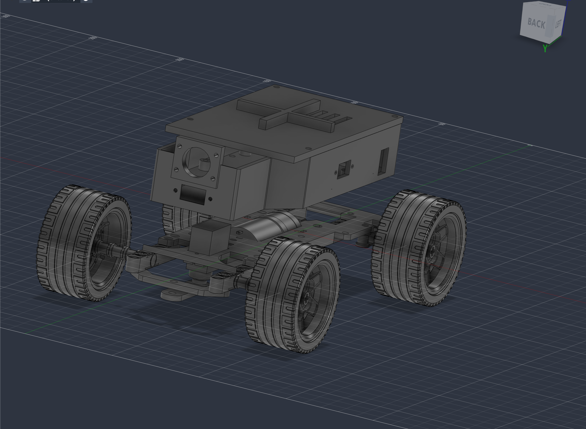
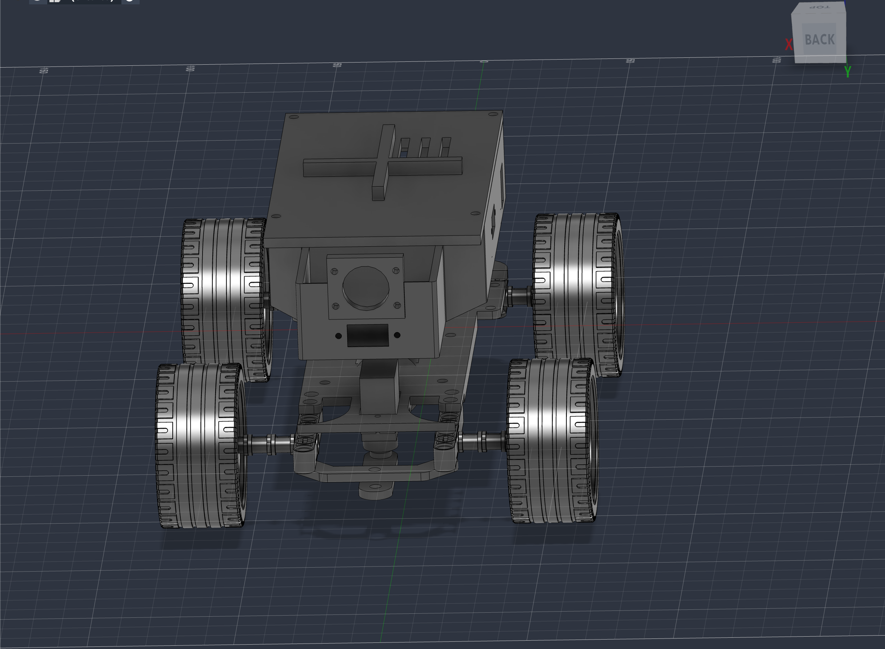
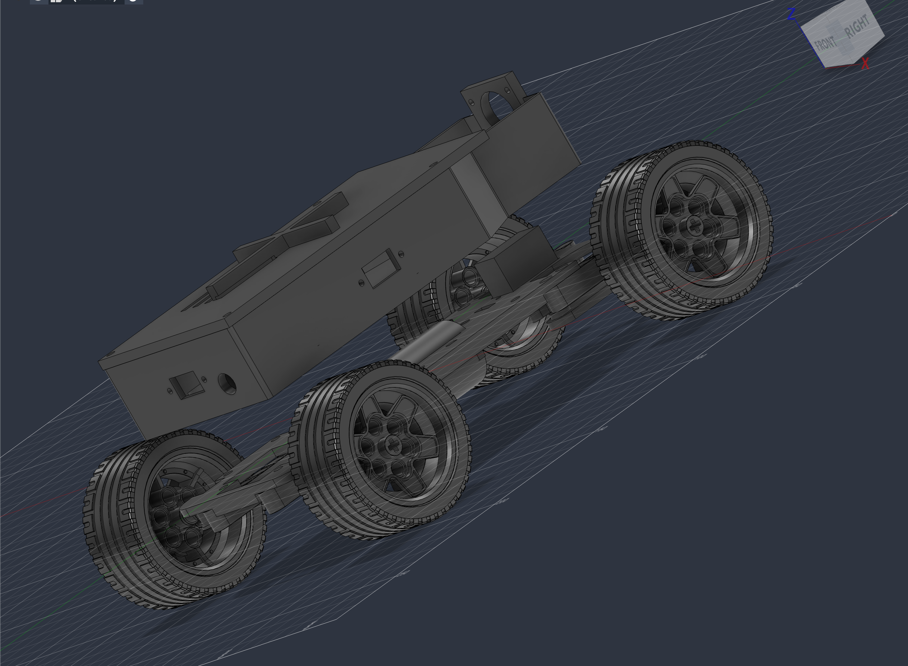
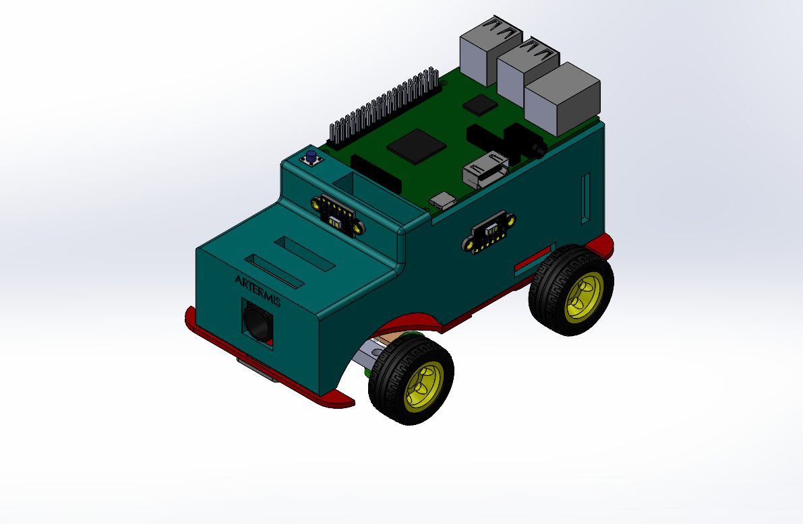

# Models — mechanical design & CAD

CAD for the Artemis vehicle, in two generations:

```
models/
├── cad-source/   # Current (gen-2) design — editable STEP sources
│   ├── New assembly test on new.step   # Full rolling-chassis assembly (frame,
│   │                                   #  wheels, steering, JGA25-370, SG90, tub)
│   ├── New assembly test on new.f3d    # Fusion 360 source of the assembly
│   ├── full_assembly_with_lid.step     # Assembly + lid placed (render-ready)
│   ├── Improved frame.step   # Chassis base plate (71 × 171 mm)
│   ├── body.step             # Tub + lid combined, in assembled position
│   ├── body_tub.step / body_lid.step / legs.step
│   └── *_print.stl           # Bed-oriented exports (duplicated in print/)
├── print/        # Current design — print-ready STLs
└── v1/           # Retired first-generation design (kept for the record)
```

## Current design (generation 2, July 2026)

<p align="center"></p>
<div align="center">


</div>

*Renders of [`cad-source/full_assembly_with_lid.step`](cad-source/full_assembly_with_lid.step) in Fusion 360 — lid on, camera nose and ToF/button apertures visible.*

The vehicle is built on a **208 mm chassis** (measured over the wheels: ≈208 L × 148 W mm, ≈100 mm tall — exactly the track wall height, well inside the 300 × 200 × 300 limit). The rolling chassis — frame plate, steering, motor, and ⌀≈55 mm wheels, wheelbase ≈152 mm — was built by our mechanical engineer; the **body is our own design**, modeled programmatically in Python (gmsh/OpenCASCADE CSG scripts) so every revision is reproducible from code rather than mouse-clicks.

### Body architecture: tub + lid

- **Tub** (`body_tub`): an open box that screws onto the frame's top-deck M3 holes and hosts the Raspberry Pi 3B+ on a standard 58 × 49 mm standoff pattern. The walls carry purpose-cut apertures: horizontal 14 × 8 mm windows for all four VL53L1X ToF boards (front/left/right/rear, boards self-tapped to the wall), a camera nose tower for the OV5647, the power rocker on the left wall, and the 12 mm start button on the rear wall. Seven floor pass-throughs route the loom.
- **Lid** (`body_lid`): a 3.5 mm screw-on cover (6 screws). The IMU bolts up through the lid into its stiffening ribs — an earlier revision used a printed boss, which we deleted when rib-mounting proved stiffer against motor vibration. The nose is deliberately left open so the lid never occludes the camera.
- **Under-tub service bay**: the tub floor sits 24 mm above the frame on **4 × M3×24 metal hex standoffs**, creating a bay beneath it for the heaviest item — the battery — kept low and central for stability. The bay was originally sized around a 3 × 18650 holder (75 × 60 × 18 mm); the pack has since been replaced by a 2S LiPo brick that lives in the same bay. `legs.step` is an optional printed alternative to the standoffs.

**Serviceability is the design's organizing principle** (see *Why we redesigned* below): lid off = every board and the full loom exposed; battery slides out of the open-sided bay without touching the electronics.

### Print notes

Printed on a Bambu Lab P1S, PLA, 0.2 mm layers. `body_tub_print.stl` and `body_lid_print.stl` are already bed-oriented: the tub prints floor-down (light supports only in window/aperture overhangs), the lid prints flat with **no supports**. All holes are self-tap pilot or clearance sizes — no printed threads.

### Iteration history (what ten body revisions taught us)

The body went through ~10 scripted revisions before printing. The instructive failures:

1. **The battery drove the architecture.** The 60 mm-wide holder physically could not fit between the tub's original corner legs on a 71 mm frame plate. We evaluated three placements (under-chassis, in-tub, on-lid) against center-of-mass and access, and settled on the under-tub bay — the decision that produced the standoff design.
2. **Integral legs doubled the print.** Printing the tub with its four 24 mm legs forced ~35 g of tree support under the raised floor and pushed the print past 5 hours. Deleting the legs (tub flat on the bed) and bridging with metal standoffs cut support material to grams — and the metal is stronger anyway.
3. **Wall cut-outs must overshoot.** Twice, a window boolean that extended exactly *to* the inner wall face left a 0.5 mm skin over the opening. Rule adopted: every cut box extends past the face it opens.
4. **Fit is checked against measured boards, not datasheet folklore.** The first external body design had the Pi hole pattern, switch cut-out, and ToF mounts wrong; we re-measured every component before modeling. The ToF windows also flipped from vertical to horizontal once we checked the actual board's long axis.
5. **Controls placement followed usage.** The start button began on the left wall 1.5 mm from the Pi — reachable, but only just. It ended up on the rear wall next to the rear ToF, 20+ mm clear of everything, where a start press can't disturb the wiring.

## Generation 1 (retired — `v1/`)

The first vehicle was a fully 3D-printed 140 × 88 × 56 mm design (76 mm wheelbase, ⌀30.4 mm LEGO wheels) built around two objectives: **compactness and component protection**. Everything lived inside the shell to protect the electronics, with a slip-fit body-to-chassis joint and ventilation cut-outs.

<p align="center"></p>

Its mechanical highlights, which still inform the current vehicle:

- **Ackermann steering geometry** — the inner wheel turns at a greater angle than the outer during cornering, reducing slip; actuated by the servo horn directly on the steering linkage. We validated the geometry in simulation before printing:

  

- **Single-motor rear drive through a custom gearbox** (bevel gears, 1:1 ratio) — the ratio preserved the motor's rated speed, prioritizing lap time over torque, because the vehicle was light enough that torque was never the constraint. A wheel encoder was wired for odometry experiments, but never adopted — the control stack ended up deliberately encoder-free (ToF distances + gyro heading).
- **Iterative chassis lightening** — material removed for steering clearance, thinner base with reinforcement extrusions at load points:

  <div align="center">
   ➡️
  
  </div>

**Why we retired it:** the very compactness we optimized for became the bottleneck the moment electrical bring-up started. Diagnosing a single suspect jumper meant disassembling the stacked body, and with the debugging phase producing faults weekly (dead motor-driver channel, counterfeit IMU, sensor repositioning — see the [root README §4](../README.md#4-engineering-decisions-and-lessons)), teardown cost dominated. The 208 mm generation-2 platform trades footprint for a longer wheelbase (steadier tracking), larger wheels, and above all **access**: nothing on the current robot requires removing more than the lid to reach.
