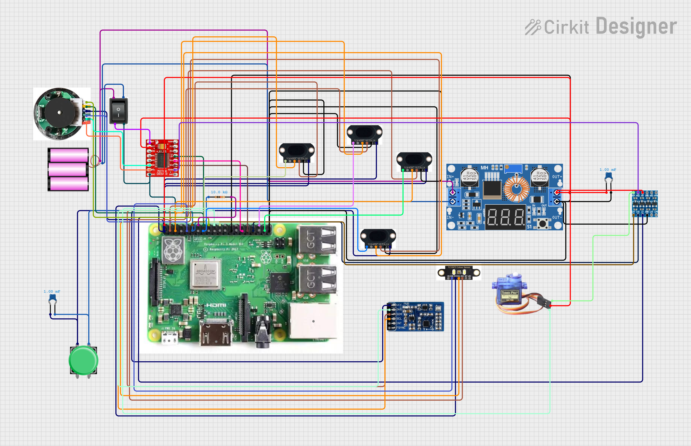

# Schemes — wiring & electromechanical diagrams

Editable source: [`circuit_image.svg`](circuit_image.svg) · full schematic PDF: [`../docs/schematics/`](../docs/schematics)

The diagram (drawn 2026-07-03 in Cirkit Designer) shows the complete electrical system: the 3S pack (3 × 18650) feeding the TB6612FNG motor driver directly and the XL4015 buck producing the 5 V rail for the Raspberry Pi 3B+, SG90 steering servo, and sensor set — 4× VL53L1X ToF via individual XSHUT lines, IMU, TCS34727 color sensor, plus the encodered gearmotor, start button, and power switch. The OV5647 camera connects via the Pi's CSI ribbon and is not part of the GPIO loom.

**Known changes since this revision of the diagram** (pin-level ground truth is always [`../src/robot/hardware_config.py`](../src/robot/hardware_config.py)):
- The MPU6050 shown was replaced by an **LSM6DSOX** on 2026-07-16 (same I2C bus wiring; the original part was a counterfeit — see the root README §4).
- The drive motor moved from TB6612 **channel B to channel A** after channel B failed at chip level; the driver's logic inputs are now driven directly from 3.3 V GPIO, so the level shifter shown remains in use only on the servo signal path.
- The color sensor now sits on a dedicated software I2C bus (GPIO20/21) to escape the address clash with the ToF boot sequence.

**Why it's wired this way** — the power-distribution reasoning, current budget, I2C bus architecture (including the 50 kHz clock and the color sensor's dedicated bus), and the failure modes each choice guards against are documented in [`../docs/power-and-sensors.md`](../docs/power-and-sensors.md). Pin assignments and I2C addresses live in code as the single source of truth: [`../src/robot/hardware_config.py`](../src/robot/hardware_config.py).
